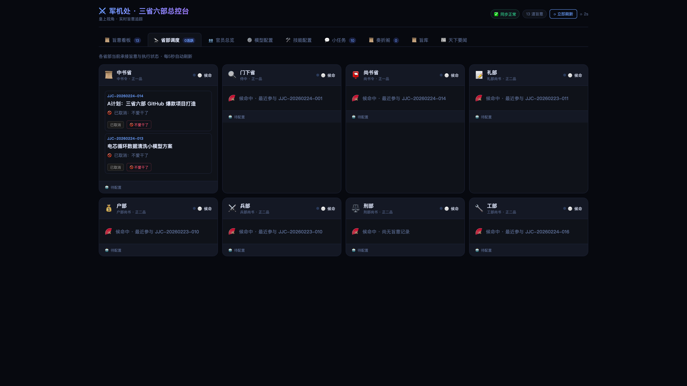
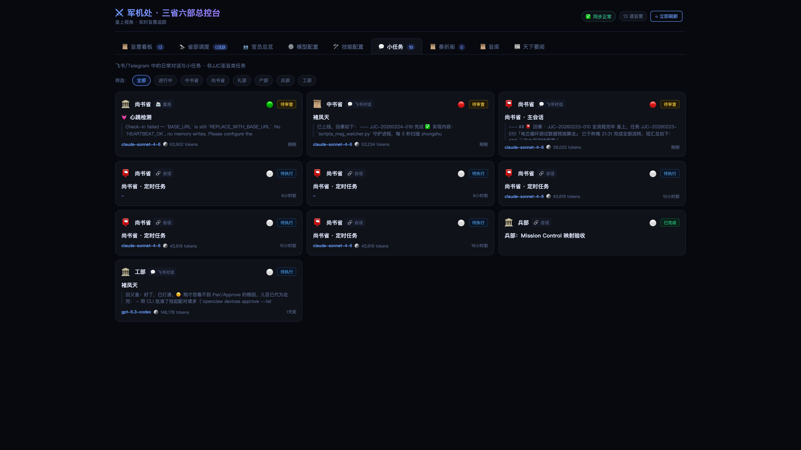
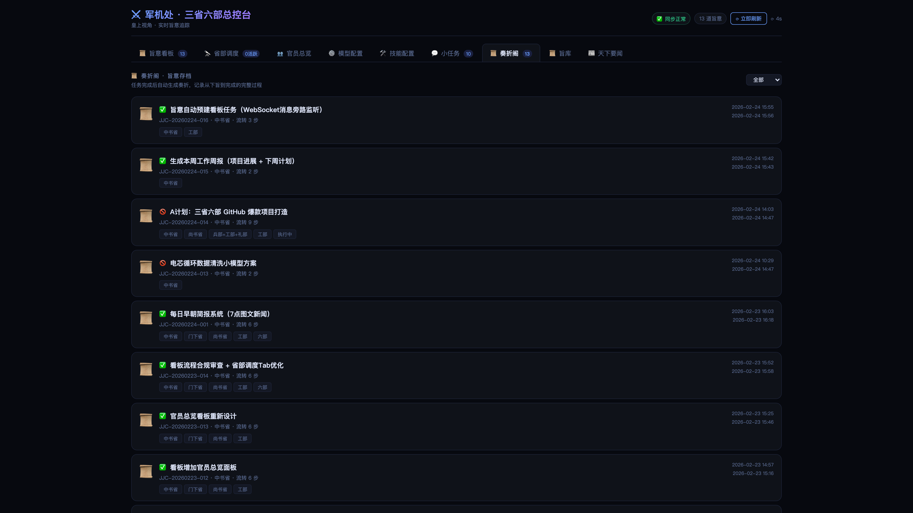
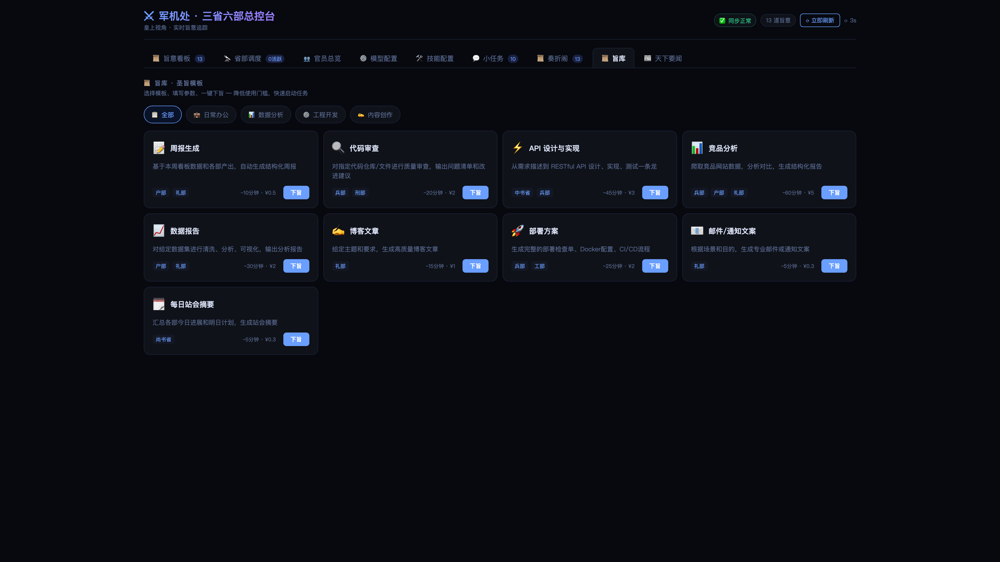
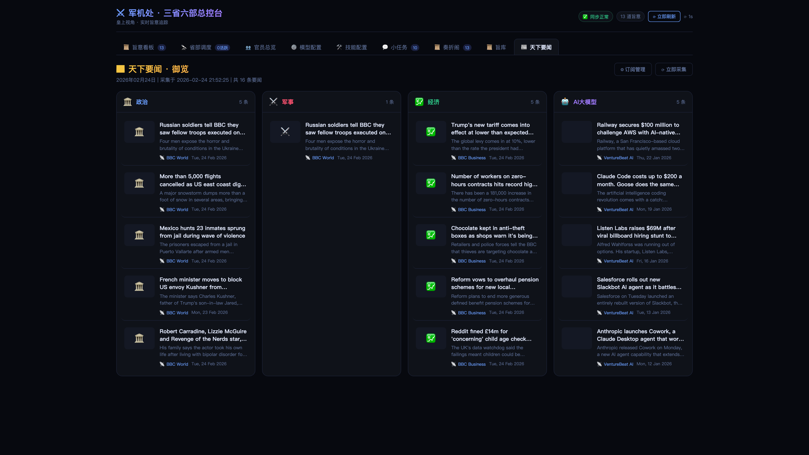

<p align="center">
  
</p>

<h1 align="center">⚔️ 三省六部 · Edict</h1>

<p align="center">
  <strong>当 AI 学会了中国古代的治国术</strong><br>
  <sub>9 个 AI Agent 组成三省六部，像治理帝国一样管理你的复杂任务</sub>
</p>

<p align="center">
  <a href="README_EN.md">English</a> ·
  <a href="#-30-秒快速体验">快速开始</a> ·
  <a href="#-架构">架构</a> ·
  <a href="#-功能全景">看板功能</a> ·
  <a href="docs/getting-started.md">详细指南</a> ·
  <a href="CONTRIBUTING.md">参与贡献</a>
</p>

<p align="center">
  
  
  
  
  
  
</p>

---

## 💡 一句话定义

> **三省六部** 是第一个将古代帝国治理智慧应用于 AI 多 Agent 协同的开源系统。
> 你下一道旨，中书省规划、门下省审议、尚书省派发、六部并行执行，最后汇总回奏。
> 附带一个开箱即用的**军机处看板**，让所有流转一目了然。

---

## 🤔 为什么是三省六部？

大多数 Multi-Agent 框架的套路是：

> *"来，你们几个 AI 自己聊，聊完把结果给我。"*

然后你拿到一坨不知道经过了什么处理的结果，无法复现，无法审计，无法干预。

**三省六部的思路完全不同** —— 我们用了一个在中国存在 1400 年的制度架构：

```
你 (皇上) → 中书省 (规划) → 门下省 (审议) → 尚书省 (派发) → 六部 (执行) → 回奏
```

这不是花哨的 metaphor，这是**真正的分权制衡**：

| | CrewAI | MetaGPT | AutoGen | **三省六部** |
|---|:---:|:---:|:---:|:---:|
| **审核机制** | ❌ 无 | ⚠️ 可选 | ⚠️ Human-in-loop | **✅ 门下省专职审核 · 可封驳** |
| **实时看板** | ❌ | ❌ | ❌ | **✅ 军机处 Kanban + 时间线** |
| **任务干预** | ❌ | ❌ | ❌ | **✅ 叫停 / 取消 / 恢复** |
| **流转审计** | ⚠️ | ⚠️ | ❌ | **✅ 完整奏折存档** |
| **Agent 健康监控** | ❌ | ❌ | ❌ | **✅ 心跳 + 活跃度检测** |
| **热切换模型** | ❌ | ❌ | ❌ | **✅ 看板内一键切换 LLM** |
| **技能管理** | ❌ | ❌ | ❌ | **✅ 查看 / 添加 Skills** |
| **新闻聚合推送** | ❌ | ❌ | ❌ | **✅ 天下要闻 + 飞书推送** |
| **部署难度** | 中 | 高 | 中 | **低 · 一键安装 / Docker** |

> **核心差异：制度性审核 + 完全可观测 + 实时可干预**
> 让 AI 协作像治国一样，有规矩、有审计、有制衡。

---

## ✨ 功能全景

### 🏛️ 九部制 Agent 架构
- **三省**（中书·门下·尚书）负责规划、审议、派发
- **六部**（户·礼·兵·刑·工 + 早朝官）负责专项执行
- 严格的权限矩阵 —— 谁能给谁发消息，白纸黑字
- 每个 Agent 独立 Workspace · 独立 Skills · 独立模型

### 📋 军机处看板（10 个功能面板）

<table>
<tr><td width="50%">

**📋 旨意看板 · Kanban**
- 按状态列展示全部任务
- 省部过滤 + 全文搜索
- 心跳徽章（🟢活跃 🟡停滞 🔴告警）
- 任务详情 + 完整流转链
- 叫停 / 取消 / 恢复操作

</td><td width="50%">

**🔭 省部调度 · Monitor**
- 可视化各状态任务数量
- 部门分布横向条形图
- Agent 健康状态实时卡片

</td></tr>
<tr><td>

**📜 奏折阁 · Memorials**
- 已完成旨意自动归档为奏折
- 五阶段时间线：圣旨→中书→门下→六部→回奏
- 一键复制为 Markdown
- 按状态筛选

</td><td>

**📜 旨库 · Template Library**
- 9 个预设圣旨模板
- 分类筛选 · 参数表单 · 预估时间和费用
- 预览旨意 → 一键下旨

</td></tr>
<tr><td>

**👥 官员总览 · Officials**
- Token 消耗排行榜
- 活跃度 · 完成数 · 会话统计

</td><td>

**📰 天下要闻 · News**
- 每日自动采集科技/财经资讯
- 分类订阅管理 + 飞书推送

</td></tr>
<tr><td>

**⚙️ 模型配置 · Models**
- 每个 Agent 独立切换 LLM
- 应用后自动重启 Gateway（~5秒生效）

</td><td>

**🛠️ 技能配置 · Skills**
- 各省部已安装 Skills 一览
- 查看详情 + 添加新技能

</td></tr>
<tr><td>

**💬 小任务 · Sessions**
- OC-* 会话实时监控
- 来源渠道 · 心跳 · 消息预览

</td><td>

**🎬 上朝仪式 · Ceremony**
- 每日首次打开播放开场动画
- 今日统计 · 3.5秒自动消失

</td></tr>
</table>

---

## 🖼️ 截图

### 旨意看板


<details>
<summary>📸 展开查看更多截图</summary>

### 省部调度


### 任务流转详情


### 模型配置


### 技能配置


### 官员总览


### 会话记录


### 奏折归档


### 圣旨模板


### 天下要闻


### 上朝仪式


</details>

---

## 🚀 30 秒快速体验

### Docker 一键启动

```bash
docker run -p 7891:7891 cft0808/edict
```
打开 http://localhost:7891 即可体验军机处看板。

### 完整安装

#### 前置条件
- [OpenClaw](https://openclaw.ai) 已安装
- Python 3.9+
- macOS / Linux

#### 安装

```bash
git clone https://github.com/cft0808/edict.git
cd edict
chmod +x install.sh && ./install.sh
```

安装脚本自动完成：
- ✅ 创建 9 个 Agent Workspace（`~/.openclaw/workspace-*`）
- ✅ 写入各省部 SOUL.md（角色人格 + 工作流规则）
- ✅ 注册 Agent 及权限矩阵到 `openclaw.json`
- ✅ 初始化数据目录 + 首次数据同步
- ✅ 重启 Gateway 使配置生效

#### 启动

```bash
# 终端 1：数据刷新循环
bash scripts/run_loop.sh

# 终端 2：看板服务器
python3 dashboard/server.py

# 打开浏览器
open http://127.0.0.1:7891
```

> 💡 详细教程请看 [Getting Started 指南](docs/getting-started.md)

---

## 🏛️ 架构

```
                           ┌───────────────────────────────────┐
                           │          👑 皇上（你）              │
                           │     Feishu · Telegram · Signal     │
                           └─────────────────┬─────────────────┘
                                             │ 下旨
                           ┌─────────────────▼─────────────────┐
                           │          📜 中书省 (zhongshu)       │
                           │       接旨 → 规划 → 拆解子任务       │
                           └─────────────────┬─────────────────┘
                                             │ 提交审核
                           ┌─────────────────▼─────────────────┐
                           │          🔍 门下省 (menxia)         │
                           │       审议方案 → 准奏 / 封驳 🚫      │
                           └─────────────────┬─────────────────┘
                                             │ 准奏 ✅
                           ┌─────────────────▼─────────────────┐
                           │          📮 尚书省 (shangshu)       │
                           │     派发任务 → 协调六部 → 汇总回奏    │
                           └───┬──────┬──────┬──────┬──────┬───┘
                               │      │      │      │      │
                         ┌─────▼┐ ┌───▼───┐ ┌▼─────┐ ┌───▼─┐ ┌▼─────┐
                         │💰 户部│ │📝 礼部│ │⚔️ 兵部│ │⚖️ 刑部│ │🔧 工部│
                         │ 数据  │ │ 文档  │ │ 工程  │ │ 合规  │ │ 基建  │
                         └──────┘ └──────┘ └──────┘ └─────┘ └──────┘
```

### 各省部职责

| 部门 | Agent ID | 职责 | 擅长领域 |
|------|----------|------|---------|
| 📜 **中书省** | `zhongshu` | 接旨、规划、拆解 | 需求理解、任务分解、方案设计 |
| 🔍 **门下省** | `menxia` | 审议、把关、封驳 | 质量评审、风险识别、标准把控 |
| 📮 **尚书省** | `shangshu` | 派发、协调、汇总 | 任务调度、进度跟踪、结果整合 |
| 💰 **户部** | `hubu` | 数据、资源、核算 | 数据处理、报表生成、成本分析 |
| 📝 **礼部** | `libu` | 文档、规范、报告 | 技术文档、API 文档、规范制定 |
| ⚔️ **兵部** | `bingbu` | 代码、算法、巡检 | 功能开发、Bug 修复、代码审查 |
| ⚖️ **刑部** | `xingbu` | 安全、合规、审计 | 安全扫描、合规检查、红线管控 |
| 🔧 **工部** | `gongbu` | CI/CD、部署、工具 | Docker 配置、流水线、自动化 |

### 权限矩阵

> 不是想发就能发 —— 真正的分权制衡

| From ↓ \ To → | 中书 | 门下 | 尚书 | 户 | 礼 | 兵 | 刑 | 工 |
|:---:|:---:|:---:|:---:|:---:|:---:|:---:|:---:|:---:|
| **中书省** | — | ✅ | ✅ | | | | | |
| **门下省** | ✅ | — | ✅ | | | | | |
| **尚书省** | ✅ | ✅ | — | ✅ | ✅ | ✅ | ✅ | ✅ |
| **六部** | | | ✅ | | | | | |

### 任务状态流转

```
收件 Inbox → 中书规划 → 门下审议 → 已派发 → 执行中 → 待审查 → ✅ 已完成
                 ↑          │                              │
                 └──── 封驳 ─┘                    阻塞 Blocked
```

---

## 📁 项目结构

```
edict/
├── agents/                     # 9 个 Agent 的人格模板
│   ├── zhongshu/SOUL.md        # 中书省 · 规划中枢
│   ├── menxia/SOUL.md          # 门下省 · 审议把关
│   ├── shangshu/SOUL.md        # 尚书省 · 调度大脑
│   ├── hubu/SOUL.md            # 户部 · 数据资源
│   ├── libu/SOUL.md            # 礼部 · 文档规范
│   ├── bingbu/SOUL.md          # 兵部 · 工程实现
│   ├── xingbu/SOUL.md          # 刑部 · 合规审计
│   ├── gongbu/SOUL.md          # 工部 · 基础设施
│   └── zaochao/SOUL.md         # 早朝官 · 情报枢纽
├── dashboard/
│   ├── dashboard.html          # 军机处看板（单文件 · 零依赖 · ~2200 行）
│   └── server.py               # API 服务器（Python 标准库 · 零依赖）
├── scripts/
│   ├── run_loop.sh             # 数据刷新循环（每 15 秒）
│   ├── sync_from_openclaw_runtime.py
│   ├── sync_agent_config.py
│   ├── sync_officials_stats.py
│   ├── fetch_morning_news.py
│   ├── refresh_live_data.py
│   ├── apply_model_changes.py
│   └── kanban_update.py
├── data/                       # 运行时数据（gitignored）
├── docs/                       # 文档 + 截图
├── install.sh                  # 一键安装脚本
├── CONTRIBUTING.md             # 贡献指南
└── LICENSE                     # MIT License
```

---

## 🎯 使用方法

### 向 AI 下旨

通过 Feishu / Telegram / Signal 给中书省发消息：

```
给我设计一个用户注册系统，要求：
1. RESTful API（FastAPI）
2. PostgreSQL 数据库
3. JWT 鉴权
4. 完整测试用例
5. 部署文档
```

**然后坐好，看戏：**

1. 📜 中书省接旨，规划子任务分配方案
2. 🔍 门下省审议，通过 / 封驳打回重规划
3. 📮 尚书省准奏，派发给兵部 + 工部 + 礼部
4. ⚔️ 各部并行执行，进度实时可见
5. 📮 尚书省汇总结果，回奏给你

全程可在**军机处看板**实时监控，随时可以**叫停、取消、恢复**。

### 使用圣旨模板

> 看板 → 📜 旨库 → 选模板 → 填参数 → 下旨

9 个预设模板：周报生成 · 代码审查 · API 设计 · 竞品分析 · 数据报告 · 博客文章 · 部署方案 · 邮件文案 · 站会摘要

### 自定义 Agent

编辑 `agents/<id>/SOUL.md` 即可修改 Agent 的人格、职责和输出规范。

---

## 🔧 技术亮点

| 特点 | 说明 |
|------|------|
| **零依赖** | 看板 + 服务器完全基于 Python 标准库 + 原生 HTML/CSS/JS |
| **单文件前端** | `dashboard.html` 一个文件，零外部依赖 |
| **纯 stdlib 后端** | `server.py` 基于 `http.server`，无需 pip install |
| **一键安装** | `install.sh` 自动完成全部配置 |
| **15 秒同步** | 数据自动刷新，看板倒计时显示 |
| **每日仪式** | 首次打开播放上朝开场动画 |

---

## 🗺️ Roadmap

- [x] 九部制 Agent 架构 + 权限矩阵
- [x] 军机处实时看板（10 个功能面板）
- [x] 任务叫停 / 取消 / 恢复
- [x] 奏折系统（自动归档 + 五阶段时间线）
- [x] 圣旨模板库（9 个预设 + 参数表单）
- [x] 上朝仪式感动画
- [x] 天下要闻 + 飞书推送 + 订阅管理
- [x] 模型热切换 + 技能管理 + 技能添加
- [x] 官员总览 + Token 消耗统计
- [x] 小任务 / 会话监控
- [ ] 功过簿（Agent 绩效评分体系）
- [ ] 御批模式（人工审批 + 一键准奏/封驳）
- [ ] 国史馆（知识库检索 + 引用溯源）
- [ ] 急递铺（Agent 间实时消息流可视化）
- [ ] 年度大考（Agent 年度绩效报告）
- [ ] Docker Compose 一键部署
- [ ] 移动端适配

---

## 🤝 参与贡献

欢迎任何形式的贡献！详见 [CONTRIBUTING.md](CONTRIBUTING.md)

特别欢迎的方向：
- 🎨 **UI 增强**：深色/浅色主题、响应式、动画优化
- 🤖 **新 Agent**：适合特定场景的专职 Agent 角色
- 📦 **Skills 生态**：各部门专用技能包
- 🔗 **集成扩展**：Notion · Jira · Linear · GitHub Issues
- 🌐 **国际化**：日文 · 韩文 · 西班牙文
- 📱 **移动端**：响应式适配、PWA

---

## ⭐ Star History

如果这个项目让你会心一笑，请给个 Star ⚔️

[](https://star-history.com/#cft0808/edict&Date)

---

## 📄 License

[MIT](LICENSE) · 由 [OpenClaw](https://openclaw.ai) 社区构建

---

<p align="center">
  <strong>⚔️ 以古制御新技，以智慧驾驭 AI</strong><br>
  <sub>Governing AI with the wisdom of ancient empires</sub>
</p>
