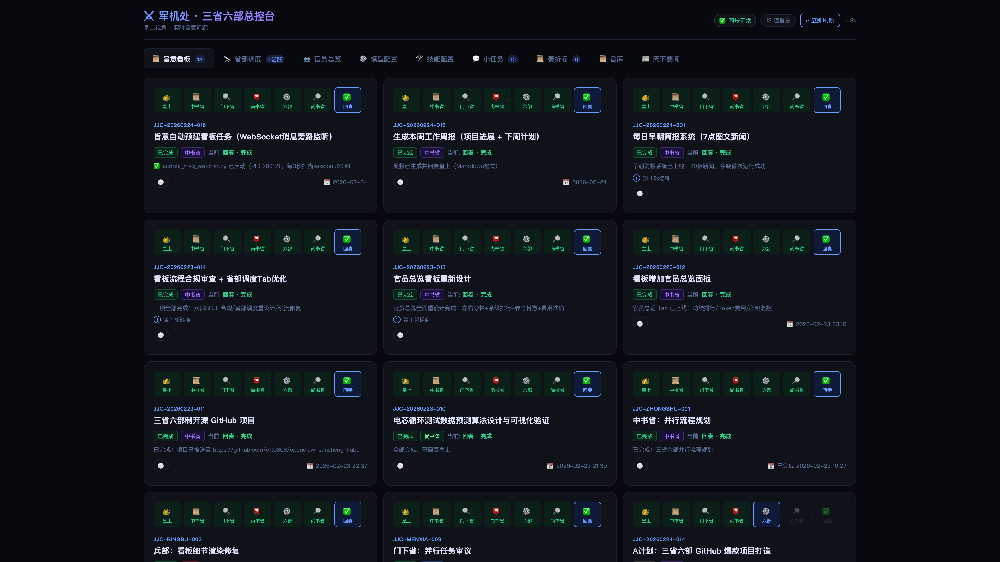
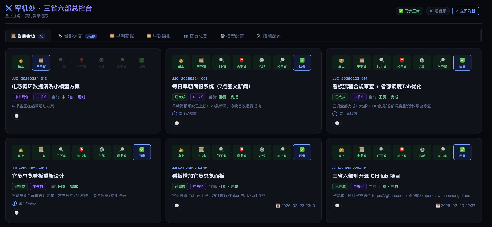
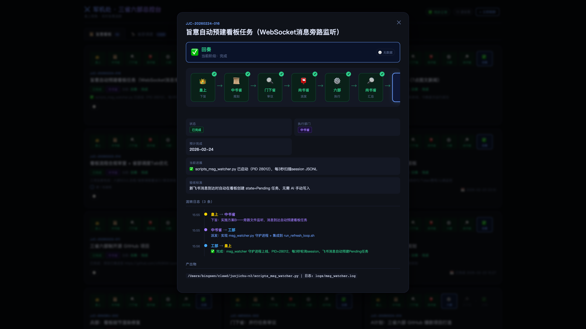
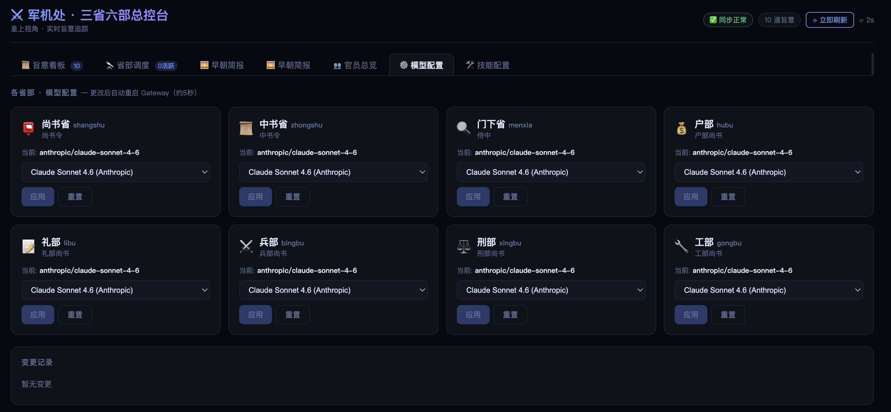
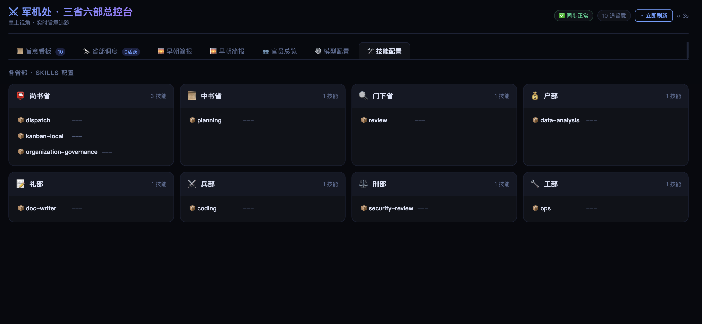
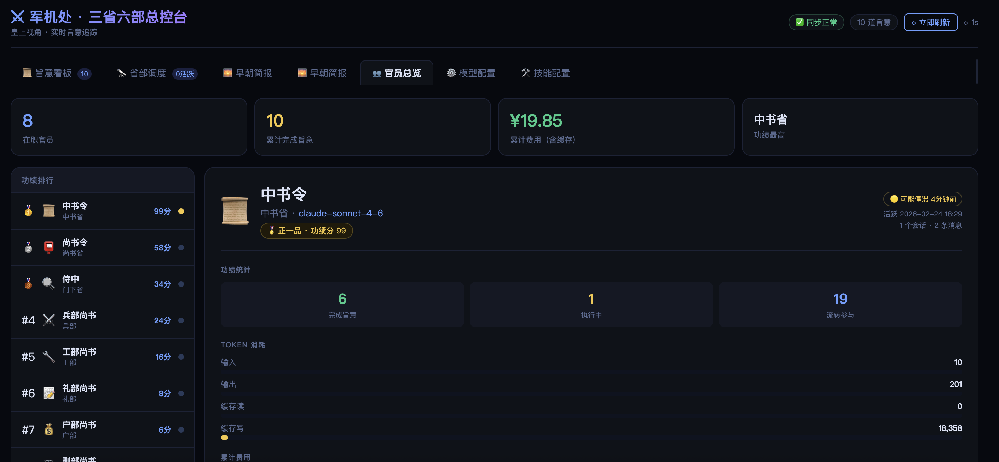

<p align="center">
  
</p>

<h1 align="center">⚔️ Edict · Multi-Agent Orchestration</h1>

<p align="center">
  <strong>What if AI learned statecraft from ancient China?</strong><br>
  <sub>9 specialized AI Agents form a government — plan, review, dispatch, execute, report.</sub>
</p>

<p align="center">
  <a href="README.md">中文</a> ·
  <a href="#-quick-start">Quick Start</a> ·
  <a href="#-architecture">Architecture</a> ·
  <a href="#-features">Dashboard</a> ·
  <a href="CONTRIBUTING.md">Contributing</a>
</p>

<p align="center">
  
  
  
  
  
  
</p>

---

## 💡 The Idea

Most multi-agent frameworks let AI agents talk freely, producing opaque results you can't audit or intervene in. **Edict** takes a radically different approach — borrowing the governance system that ran China for 1,400 years:

```
You (Emperor) → Planning Dept → Review Dept → Dispatch Dept → 6 Ministries → Report Back
   皇上           中书省           门下省          尚书省           六部          回奏
```

This isn't a cute metaphor. It's **real separation of powers** for AI:

- **Planning (中书省)** breaks your command into actionable sub-tasks
- **Review (门下省)** audits the plan — can reject and force re-planning
- **Dispatch (尚书省)** assigns approved tasks to specialist ministries
- **6 Ministries** execute in parallel, each with distinct expertise
- Everything flows through a **real-time dashboard** you can monitor and intervene

---

## 🤔 Why Edict?

> **"Instead of one AI doing everything wrong, 9 specialized agents check each other's work."**

| | CrewAI | MetaGPT | AutoGen | **Edict** |
|---|:---:|:---:|:---:|:---:|
| **Built-in review/veto** | ❌ | ⚠️ | ⚠️ | **✅ Dedicated reviewer** |
| **Real-time Kanban** | ❌ | ❌ | ❌ | **✅ 10-panel dashboard** |
| **Task intervention** | ❌ | ❌ | ❌ | **✅ Stop / Cancel / Resume** |
| **Full audit trail** | ⚠️ | ⚠️ | ❌ | **✅ Memorial archive** |
| **Agent health monitoring** | ❌ | ❌ | ❌ | **✅ Heartbeat detection** |
| **Hot-swap LLM models** | ❌ | ❌ | ❌ | **✅ From the dashboard** |
| **Skill management** | ❌ | ❌ | ❌ | **✅ View / Add skills** |
| **News aggregation** | ❌ | ❌ | ❌ | **✅ Daily digest + webhook** |
| **Setup complexity** | Med | High | Med | **Low · One-click / Docker** |

---

## ✨ Features

### 🏛️ Nine-Department Agent Architecture
- **Three Departments** (Planning · Review · Dispatch) for governance
- **Six Ministries** (Finance · Docs · Engineering · Compliance · Infrastructure + Briefing) for execution
- Strict permission matrix — who can message whom is enforced
- Each agent: own workspace, own skills, own LLM model

### 📋 Command Center Dashboard (10 Panels)

| Panel | Description |
|-------|------------|
| 📋 **Edicts Kanban** | Task cards by state, filters, search, heartbeat badges, stop/cancel/resume |
| 🔭 **Department Monitor** | Pipeline visualization, distribution charts, health cards |
| 📜 **Memorial Archive** | Auto-generated archives with 5-phase timeline |
| 📜 **Edict Templates** | 9 presets with parameter forms, cost estimates, one-click dispatch |
| 👥 **Officials Overview** | Token leaderboard, activity stats |
| 📰 **Daily Briefing** | Auto-curated news, subscription management, Feishu push |
| ⚙️ **Model Config** | Per-agent LLM switching, automatic Gateway restart |
| 🛠️ **Skills Config** | View installed skills, add new ones |
| 💬 **Sessions** | Live session monitoring with channel labels |
| 🎬 **Court Ceremony** | Immersive daily opening animation with stats |

---

## 🖼️ Screenshots

### Edicts Kanban


<details>
<summary>📸 More screenshots</summary>

### Daily Briefing


### Task Detail


### Model Config


### Skills


### Officials


</details>

---

## 🚀 Quick Start

### Docker

```bash
docker run -p 7891:7891 cft0808/edict
```
Open http://localhost:7891

### Full Install

**Prerequisites:** [OpenClaw](https://openclaw.ai) · Python 3.9+ · macOS/Linux

```bash
git clone https://github.com/cft0808/edict.git
cd edict
chmod +x install.sh && ./install.sh
```

The installer automatically:
- Creates 9 agent workspaces (`~/.openclaw/workspace-*`)
- Writes SOUL.md personality files for each department
- Registers agents + permission matrix in `openclaw.json`
- Initializes data directory + first sync
- Restarts Gateway

### Launch

```bash
# Terminal 1: Data sync loop (every 15s)
bash scripts/run_loop.sh

# Terminal 2: Dashboard server
python3 dashboard/server.py

# Open browser
open http://127.0.0.1:7891
```

> 📖 See [Getting Started Guide](docs/getting-started.md) for detailed walkthrough.

---

## 🏛️ Architecture

```
                           ┌───────────────────────────────────┐
                           │         👑 Emperor (You)           │
                           │     Feishu · Telegram · Signal     │
                           └─────────────────┬─────────────────┘
                                             │ Issue edict
                           ┌─────────────────▼─────────────────┐
                           │      📜 Planning Dept (中书省)      │
                           │     Receive → Plan → Decompose      │
                           └─────────────────┬─────────────────┘
                                             │ Submit for review
                           ┌─────────────────▼─────────────────┐
                           │       🔍 Review Dept (门下省)       │
                           │     Audit → Approve / Reject 🚫     │
                           └─────────────────┬─────────────────┘
                                             │ Approved ✅
                           ┌─────────────────▼─────────────────┐
                           │      📮 Dispatch Dept (尚书省)      │
                           │   Assign → Coordinate → Collect     │
                           └───┬──────┬──────┬──────┬──────┬───┘
                               │      │      │      │      │
                         ┌─────▼┐ ┌───▼───┐ ┌▼─────┐ ┌───▼─┐ ┌▼─────┐
                         │💰 Fin.│ │📝 Docs│ │⚔️ Eng.│ │⚖️ Law│ │🔧 Ops│
                         │ 户部  │ │ 礼部  │ │ 兵部  │ │ 刑部 │ │ 工部  │
                         └──────┘ └──────┘ └──────┘ └─────┘ └──────┘
```

### Agent Roles

| Dept | Agent ID | Role | Expertise |
|------|----------|------|-----------|
| 📜 **Planning** | `zhongshu` | Receive, plan, decompose | Requirements, architecture |
| 🔍 **Review** | `menxia` | Audit, gatekeep, veto | Quality, risk, standards |
| 📮 **Dispatch** | `shangshu` | Assign, coordinate, collect | Scheduling, tracking |
| 💰 **Finance** | `hubu` | Data, resources, accounting | Data processing, reports |
| 📝 **Documentation** | `libu` | Docs, standards, reports | Tech writing, API docs |
| ⚔️ **Engineering** | `bingbu` | Code, algorithms, checks | Development, code review |
| ⚖️ **Compliance** | `xingbu` | Security, compliance, audit | Security scanning |
| 🔧 **Infrastructure** | `gongbu` | CI/CD, deploy, tooling | Docker, pipelines |

### Permission Matrix

| From ↓ \ To → | Planning | Review | Dispatch | Ministries |
|:---:|:---:|:---:|:---:|:---:|
| **Planning** | — | ✅ | ✅ | |
| **Review** | ✅ | — | ✅ | |
| **Dispatch** | ✅ | ✅ | — | ✅ all |
| **Ministries** | | | ✅ | |

### State Machine

```
Inbox → Planning → Review → Assigned → Executing → Under Review → ✅ Done
            ↑         │                                    │
            └── Veto ──┘                          Blocked ──
```

---

## 📁 Project Structure

```
edict/
├── agents/                     # 9 agent personality templates (SOUL.md)
├── dashboard/
│   ├── dashboard.html          # Single-file dashboard (zero deps, ~2200 lines)
│   └── server.py               # API server (Python stdlib only)
├── scripts/                    # Data sync & automation scripts
├── data/                       # Runtime data (gitignored)
├── docs/                       # Documentation + screenshots
├── install.sh                  # One-click installer
└── LICENSE                     # MIT
```

---

## 🔧 Technical Highlights

| | |
|---|---|
| **Zero dependencies** | Dashboard + server on Python stdlib + vanilla HTML/CSS/JS |
| **Single-file frontend** | One file, all UI, works offline |
| **stdlib backend** | No pip install needed |
| **One-click install** | Workspace creation to Gateway restart |
| **15s auto-sync** | Live data refresh with countdown |
| **Daily ceremony** | Immersive opening animation |

---

## 🗺️ Roadmap

- [x] Nine-department agent architecture + permissions
- [x] Real-time dashboard (10 panels)
- [x] Task stop / cancel / resume
- [x] Memorial archive (5-phase timeline)
- [x] Edict template library (9 presets)
- [x] Court ceremony animation
- [x] Daily news + Feishu webhook push
- [x] Hot-swap LLM models + skill management
- [x] Officials overview + token stats
- [x] Session monitoring
- [ ] Merit/demerit ledger (agent scoring)
- [ ] Imperial approval mode (human-in-the-loop)
- [ ] Imperial Archives (knowledge base)
- [ ] Express courier (inter-agent message viz)
- [ ] Annual review (yearly reports)
- [ ] Docker Compose deployment
- [ ] Mobile responsive

---

## 🤝 Contributing

All contributions welcome! See [CONTRIBUTING.md](CONTRIBUTING.md)

- 🎨 **UI** — themes, responsiveness, animations
- 🤖 **New agents** — specialized roles
- 📦 **Skills** — ministry-specific packages
- 🔗 **Integrations** — Notion · Jira · Linear · GitHub Issues
- 🌐 **i18n** — Japanese · Korean · Spanish
- 📱 **Mobile** — responsive, PWA

---

## 📄 License

[MIT](LICENSE) · Built by the [OpenClaw](https://openclaw.ai) community

---

<p align="center">
  <strong>⚔️ Governing AI with the wisdom of ancient empires</strong><br>
  <sub>以古制御新技，以智慧驾驭 AI</sub>
</p>
